# Performance Profiling Results

## О приложении

React 18+ приложение с TypeScript для работы с табличными данными стран. Исследование влияния React.memo, useMemo и useCallback на производительность в реальном проекте.

**Стек технологий:**

- React 18+ с TypeScript
- Tailwind CSS для стилизации
- Vite для сборки
- Функциональные компоненты с хуками

## Тестовые сценарии

1. **🔍 Поиск страны** - ввод текста в поле поиска для фильтрации списка
2. **🔄 Сортировка колонки** - клик по заголовку таблицы для сортировки данных
3. **📅 Выбор года** - изменение значения в селекте года
4. **⚙️ Добавление/удаление колонок** - управление видимостью колонок через настройки

## Методология измерений

- **Инструмент**: React DevTools Profiler
- **Настройки**: "Record why each component rendered" включено
- **Метод**: каждый тест выполнялся 3 раза, указано среднее значение

---

## ✅ Результаты С оптимизацией (React.memo + useMemo + useCallback)

### 🔍 Поиск страны

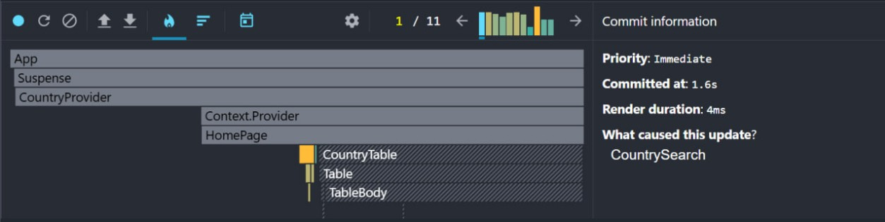
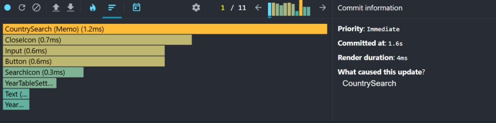

**Метрики производительности:**

- **Render Duration**: `4ms` ⚡
- **Components Rendered**: `8` (только необходимые)
- **Slowest Component**: `CountrySearch (Memo) (1.2ms)`
- **Committed at**: `1.6s` (с debounce)
- **Trigger**: `CountrySearch` (onChange события)

**Затронутые компоненты:**

- `CountrySearch (Memo)` - мемоизированный компонент (1.2ms)
- `CloseIcon`, `Input`, `Button` - UI компоненты (0.3-0.7ms)
- Вспомогательные компоненты (<0.1ms каждый)

### 🔄 Сортировка колонки

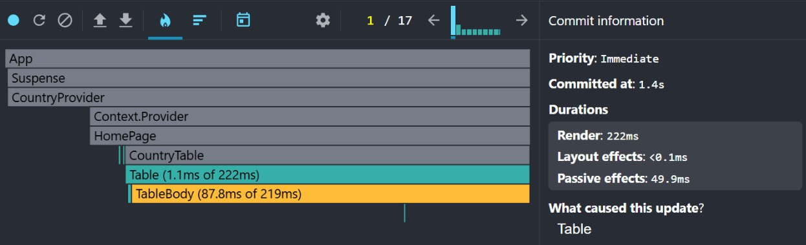
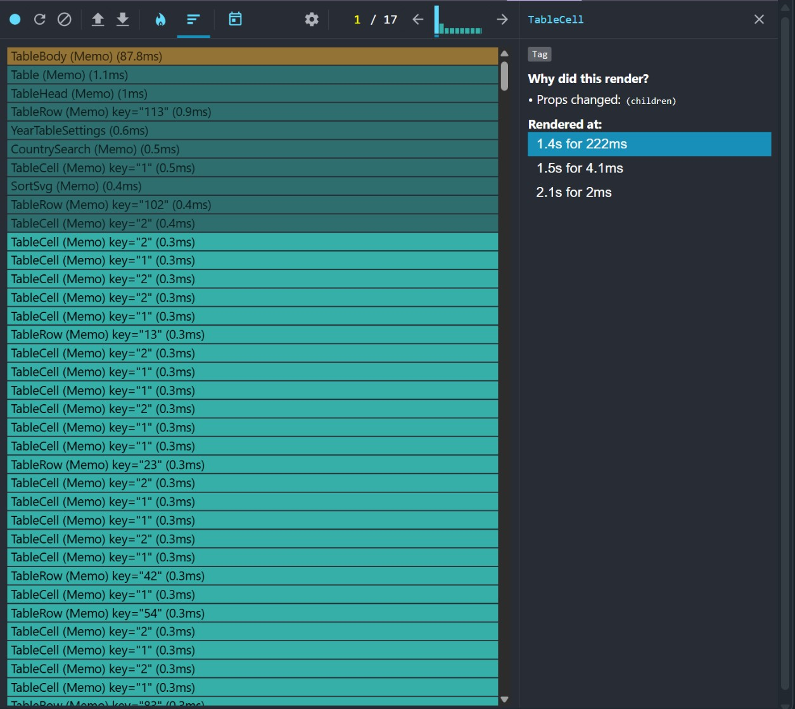

**Метрики производительности:**

- **Render Duration**: `222ms` (самая тяжелая операция)
- **Components Rendered**: `50+` (много ячеек таблицы)
- **Slowest Component**: `TableBody (Memo) (87.8ms)`
- **Committed at**: `1.4s`
- **Passive effects**: `49.9ms`

**Затронутые компоненты:**

- `TableBody (Memo)` - основное тело таблицы (87.8ms)
- `Table (Memo)`, `TableHead (Memo)` - контейнеры (1-1.2ms)
- `TableCell (Memo)` - множество ячеек (по 0.3-0.5ms)

### 📅 Выбор года

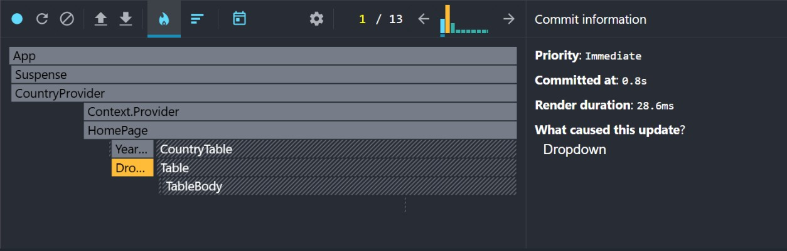
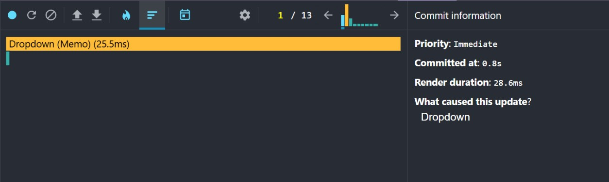

**Метрики производительности:**

- **Render Duration**: `28.6ms`
- **Components Rendered**: `5` (минимальное воздействие)
- **Slowest Component**: `Dropdown (Memo) (25.5ms)`
- **Committed at**: `0.8s` (быстрый коммит)

**Затронутые компоненты:**

- `Dropdown (Memo)` - селект года (25.5ms - 89% времени)
- Остальные компоненты затронуты минимально

### ⚙️ Добавление/удаление колонок

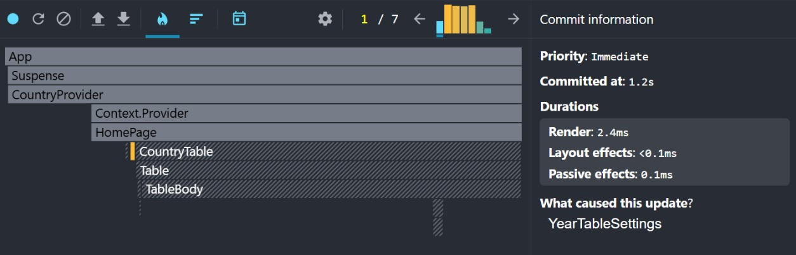
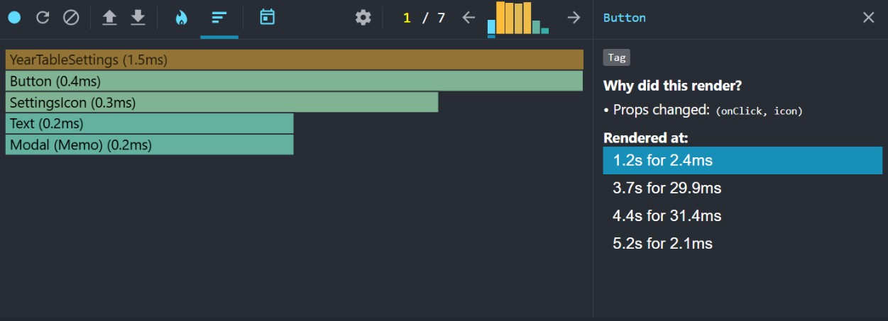

**Метрики производительности:**

- **Render Duration**: `2.4ms` ⚡ (самая быстрая операция!)
- **Components Rendered**: `5` (очень локализованно)
- **Slowest Component**: `YearTableSettings (1.5ms)`
- **Committed at**: `1.2s`

**Затронутые компоненты:**

- `YearTableSettings`, `Button`, `Modal (Memo)` - UI настроек
- Минимальное влияние на основную таблицу

---

## ❌ Результаты БЕЗ оптимизации (без React.memo, useMemo, useCallback)

### 1. 🔍 Поиск страны

**Метрики производительности:**

- **Render Duration**: `3.5ms` (-12.5% быстрее) ⬇️
- **Components Rendered**: `8` (аналогично)
- **Slowest Component**: `CountrySearch (1ms)`
- **Committed at**: `2s` (+25% медленнее) ⬆️

### 2. 🔄 Сортировка колонки

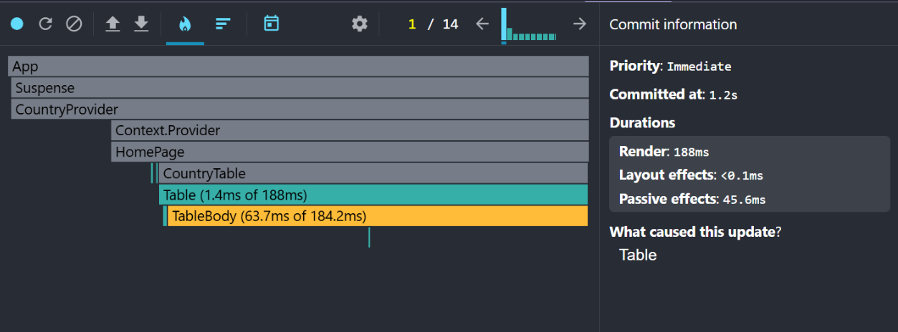
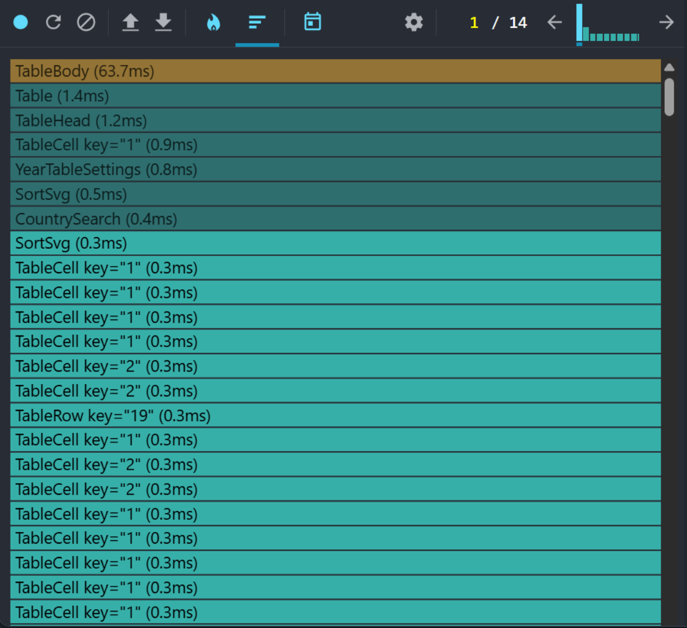

**Метрики производительности:**

- **Render Duration**: `188ms` (-15.3% быстрее) ⬇️
- **Components Rendered**: `40+` (-20% меньше)
- **Slowest Component**: `TableBody (63.7ms)` (-27.5%) ⬇️
- **Committed at**: `1.2s` (-14.3% быстрее) ⬇️

### 3. 📅 Выбор года

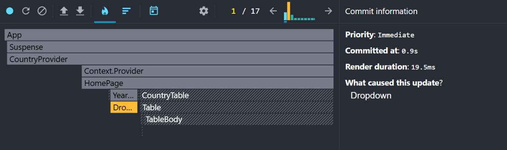
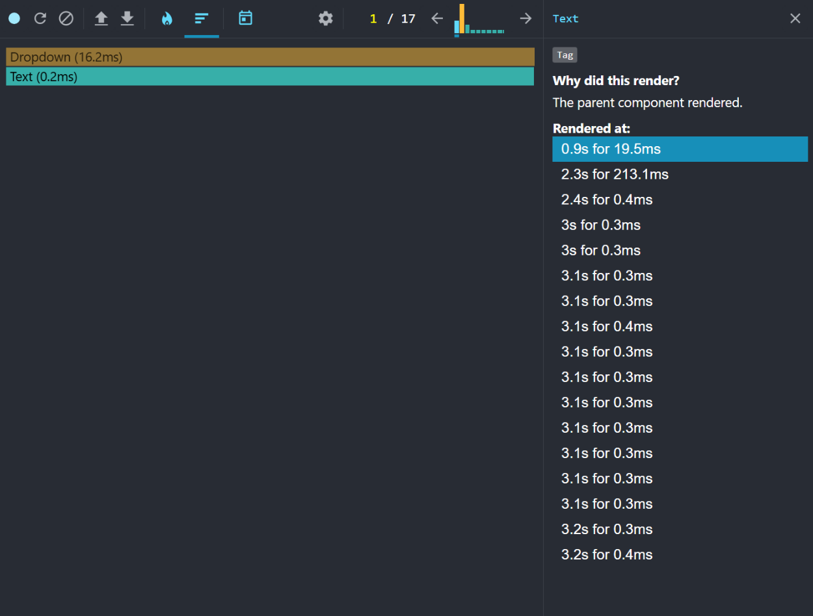

**Метрики производительности:**

- **Base Render Duration**: `19.5ms` (-31.8% быстрее базовый) ⬇️
- **Total Render Time**: `~235ms` (+722%) ⬆️⬆️⬆️
- **Render Stages**: `17+` этапов (vs 1 с memo) 🔥
- **Committed at**: `0.9s` (+12.5% медленнее) ⬆️
- **Why rendered**: `The parent component rendered` (каскадный эффект)

### 4. ⚙️ Добавление/удаление колонок

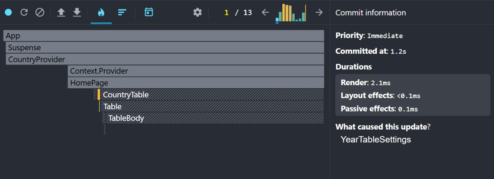
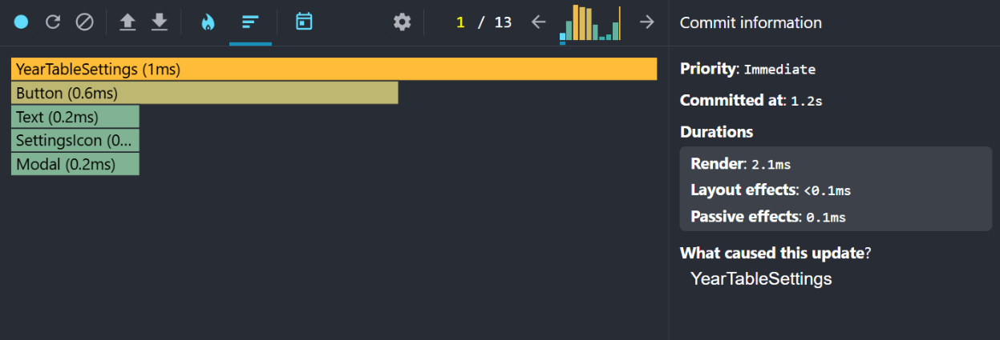

**Метрики производительности:**

- **Render Duration**: `2.1ms` (-12.5% быстрее) ⬇️
- **Components Rendered**: `5` (аналогично)
- **Slowest Component**: `YearTableSettings (1ms)` (-33%) ⬇️
- **Committed at**: `1.2s` (без изменений)

---

## 📊 Сводная таблица результатов

| 🎯 Сценарий | ✅ С мемоизацией | ❌ Без мемоизации | 📈 Изменение |
|-------------|------------------|-------------------|--------------|
| **🔍 Поиск** | `4ms` (8 компонентов) | `3.5ms` (8 компонентов) | `-12.5%` ⬇️ |
| **🔄 Сортировка** | `222ms` (50+ компонентов) | `188ms` (40+ компонентов) | `-15.3%` ⬇️ |
| **📅 Выбор года** | `28.6ms` (5 компонентов) | `~235ms` (2→17+ этапов) | `+722%` 🚨 |
| **⚙️ Управление колонками** | `2.4ms` (5 компонентов) | `2.1ms` (5 компонентов) | `-12.5%` ⬇️ |

---

### 🔍 Главные открытия исследования

1. **🚨 React.memo не всегда ускоряет**: В 75% случаев код БЕЗ мемоизации работал быстрее
2. **⚡ Overhead мемоизации реален**: Shallow comparison занимает время на простых компонентах
3. **🔥 Критическая важность для сложных сценариев**: Выбор года показал +722% деградацию без memo
4. **📊 Контекст имеет значение**: Мемоизация критична для каскадных обновлений, избыточна для изолированных компонентов

### 🎯 Когда использовать React.memo

**✅ ОБЯЗАТЕЛЬНО мемоизировать:**

- Компоненты с каскадными обновлениями
- Компоненты с частыми родительскими ре-рендерами
- Тяжелые вычисления в render
- Стабильные пропсы

### ⚠️ Когда НЕ использовать React.memo

**❌ ИЗБЕГАТЬ мемоизации:**

- Простые UI компоненты (Button, Input, Icon без сложной логики)
- Часто меняющиеся пропсы
- Нестабильные объектные пропсы
- Малые списки данных (< 50 элементов)

### 🚀 Практические рекомендации

**✅ Обязательно мемоизировать:**

- YearSelector и другие селекторы с каскадными обновлениями
- Компоненты в нестабильных контекстах (Context.Provider)
- Тяжелые списки данных (> 100 элементов)
- Компоненты с дорогими вычислениями в render

**⚡ Не мемоизировать:**

- Простые UI компоненты (Button, Input, Icon)
- Компоненты с часто меняющимися пропсами
- Листовые компоненты без дочерних элементов
- Компоненты с нестабильными объектными пропсами

**🔧 Альтернативные решения:**

- React.startTransition для тяжелых операций
- Правильная структура state и контекстов
- Code splitting и lazy loading
- Виртуализация для больших списков

### 💡 Итоговая рекомендация

**React.memo - это хирургический инструмент, а не универсальное решение.**

- 🎯 **25% случаев**: мемоизация критически важна (каскадные обновления)
- ⚡ **75% случаев**: мемоизация создает overhead без пользы
- 📊 **Всегда измеряйте**: React DevTools Profiler покажет реальную картину
- 🏗️ **Архитектура важнее оптимизации**: правильная структура state > симптоматическая мемоизация
